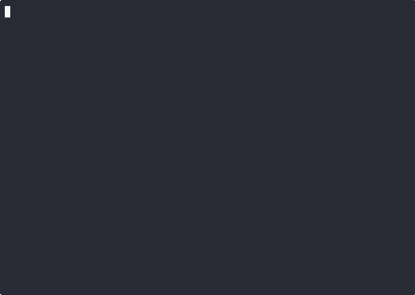
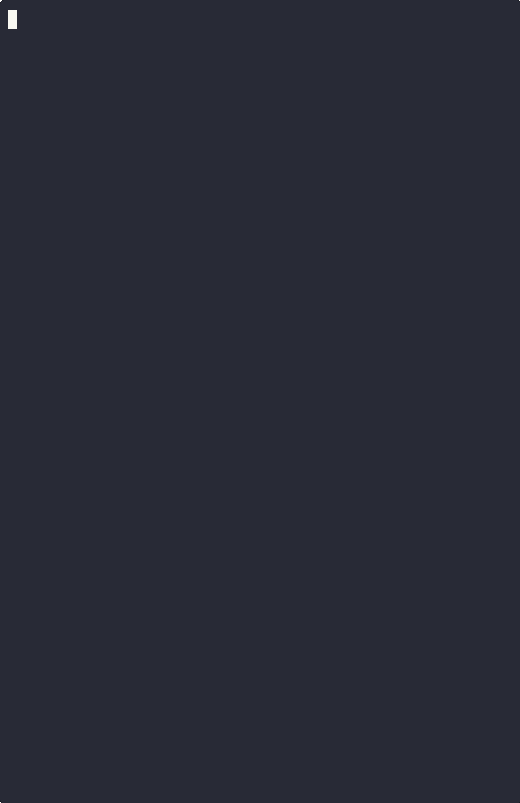

# BasementUI

A modern, reactive Terminal User Interface (TUI) library for Go, inspired by **[uhtml](https://github.com/WebReflection/uhtml)**, **[Preact Signals](https://github.com/preactjs/signals)**, and **[echomd](https://github.com/WebReflection/echomd)**.

## Features

*   **Reactive State**: Built-in Signal-based state management.
*   **Markdown Templating**: Use `basement` syntax to style your UI.
*   **Efficient Rendering**: Virtual screen buffer with diffing to prevent flickering.
*   **Input Handling**: Cross-platform raw mode and keyboard event support.
*   **Layout System**: Flexbox-like layout engine with Rows, Columns, and Borders.
*   **Optional Syntax Highlighting**: Support for Chroma (via build tag).
*   **No Virtual DOM**: Updates are fine-grained and bound directly to the screen buffer.

## Architecture

BasementUI combines **Fine-Grained Reactivity** with **Double-Buffered Rendering**.

1.  **Reactivity**: Unlike React (which diffs VDOM trees), BasementUI uses Signals. When a signal changes, only the dependent parts of the UI are re-evaluated.
2.  **Rendering**: The UI tree is drawn to a "Back Buffer". This buffer is then diffed against the "Front Buffer" (what's on screen), and only the changed cells are flushed to the terminal. This mimics how GPUs work and ensures high performance without flickering.
3.  **Pipeline**: `Parse (Markdown) -> Tree (AST) -> Measure (Layout) -> Draw (Buffer) -> Diff/Flush`.

## Getting Started

### Installation

Clone the repository and import the local package:

```bash
git clone https://github.com/AhnafCodes/basementui.git
```

### Usage

```go
package main

import (
	"basement/signals"
	"basement/tui"
	"time"
)

func main() {
	// 1. Create State
	count := signals.New(0)

	// 2. Define View
	app := func() tui.Renderable {
		return tui.Template(`
# Counter App
Current count: **%v**

(Press 'q' or Ctrl+C to exit)
`, count)
	}

	// 3. Mount to Screen
	screen := tui.NewScreen()
	defer screen.Close() // Restore terminal on exit

	tui.Render(screen, app)

	// Update state
	go func() {
		for {
			time.Sleep(1 * time.Second)
			count.Set(count.Get() + 1)
		}
	}()

	// Wait for exit signal
	quit := make(chan bool)
	screen.OnKey(func(ev tui.KeyEvent) {
		// Handle 'q' or Ctrl+C to exit
		if ev.Rune == 'q' || (ev.Key == tui.KeyChar && ev.Mod == tui.ModCtrl && ev.Rune == 'c') {
			quit <- true
		}
	})
	<-quit
}
```

## Input Handling & Raw Mode

BasementUI automatically switches the terminal to **Raw Mode** to capture input directly. This has two important implications:

1.  **Cleanup is Required**: You **must** call `screen.Close()` (usually via `defer`) before your program exits. If you don't, the terminal will remain in raw mode (no echo, weird formatting) until you run `reset`.
2.  **Manual Exit Handling**: Standard signals like `SIGINT` (Ctrl+C) are captured as keyboard events. The application will **not** exit automatically. You must listen for `Ctrl+C` (which appears as `KeyChar` with `ModCtrl`) and exit the loop manually.

## Scrolling

BasementUI supports vertical scrolling for content that exceeds the screen height.

*   **Automatic**: The `Screen` automatically detects the terminal size.
*   **Manual Control**: You can control the scroll position by modifying `screen.ScrollY`.
*   **Example**: See `example11_markdown` for a scrollable document implementation.

## Optional Syntax Highlighting

To enable syntax highlighting for code blocks, build your application with the `chroma` tag:

```bash
go build -tags chroma .
```

This pulls in the `github.com/alecthomas/chroma` dependency. Without this tag, code blocks are rendered as plain dimmed text (zero dependencies).

## Examples

We provide several examples to demonstrate the capabilities of BasementUI, ranging from basic static text to complex reactive components.

You can run them using `make`:

### Example 1: Hello World (Static Text)

```bash
make example1
```



### Example 2: Reactive Counter (Basic Signals)

```bash
make example2
```


### Example 3: Computed Values (Derived State)

```bash
make example3
```


### Example 4: Digital Clock (Real-time Updates)

```bash
make example4
```


### Example 5: Progress Bar (Custom Components)

```bash
make example5
```


### Example 6: Conditional Rendering (Dynamic UI)

```bash
make example6
```


### Example 7: Input Handling (Keyboard Events)

```bash
make example7
```


### Example 8: Text Input (Interactive Form)

```bash
make example8
```


### Example 9: Interactive List (Menu Navigation)

```bash
make example9
```


### Example 10: Responsive Layout (Flexbox Dashboard)

```bash
make example10
```



### Example 11: Markdown Rendering (Complex Document with Scrolling)

```bash
make example11
```


### Example 12: Syntax Highlighting (Optional Chroma Integration)

```bash
make example12         # Default (No highlighting)
make example12-chroma  # With highlighting
```


## Running the Demo

```bash
make demo
```

## Running Tests

```bash
make test
```
